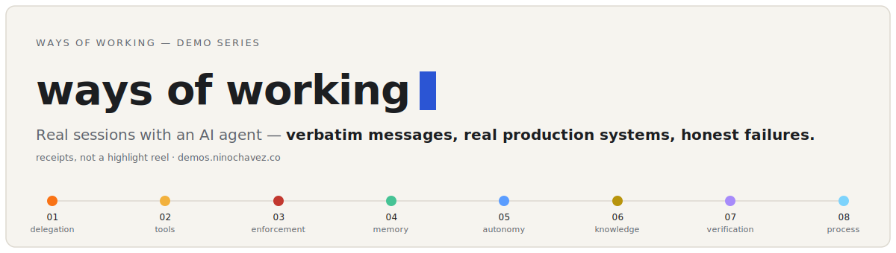

# ways of working — demo series



Public teaching demos of real AI-agent working sessions, hosted at
[demos.ninochavez.co](https://demos.ninochavez.co). Each demo is one real
session: verbatim messages, real production systems, honest failures.

## The demos

Ordered 01 → 08; each title links to the live session.

- **[01 · Twelve Messages](https://demos.ninochavez.co/twelve-messages/)** — Everything typed to take a live event from spreadsheet chaos to published social content — and the method that made the other 99% happen.
- **[02 · The Browser Is a Shell Command](https://demos.ninochavez.co/browse-tool/)** — Replacing 18,000 tokens of always-loaded browser-automation schema with ten shell commands and a README — and why the agent gets sharper, not weaker.
- **[03 · Taught Once, Enforced Forever](https://demos.ninochavez.co/enforced-forever/)** — Corrections given in chat decay when the session ends. The fix is changing the agent's environment — helpers, deny-hooks, and CI ratchets that carry the rule forever.
- **[04 · Your Sessions Are a Corpus](https://demos.ninochavez.co/session-corpus/)** — 2,747 agent-session transcripts, mined: reusable prompts, your corrections as standing priors, and an honest ledger of what the agent built that survived.
- **[05 · The Product That Files Its Own Tickets](https://demos.ninochavez.co/feedback-loop/)** — End users file feedback, an LLM judge triages it into GitHub Issues, an agent implements the safe ones — with the autonomy boundary in deterministic code and a human holding the only merge key.
- **[06 · The Registry of Landmines](https://demos.ninochavez.co/landmine-registry/)** — Some load-bearing facts are invisible to search — the code compiles and the behavior is still wrong. One registry file holds them, a derive catalog enforces them in CI, and a meta-test keeps the registry from lying about itself.
- **[07 · The Agent Said It Checked](https://demos.ninochavez.co/said-it-checked/)** — "Verified" is a sentence, not a fact. A security migration passed its audit while production was broken — and the discipline that came out of it caught three more false claims building this very series.
- **[08 · Gates Between Agentic Stages](https://demos.ninochavez.co/agentic-gates/)** — Agents are strong inside a stage and unreliable at the boundaries. A delivery methodology built on that: deterministic gates between agentic stages — 88 versioned revisions, 14 running initiatives, and the day production published fiction.

## Layout

```
demos/<slug>/
  deck.html   page content only (no <html>/<head>/<body> — build wraps it)
  meta.json   index-card fields: number, title, hook, date, for/get/do, preview
  img/        the demo's images, referenced as img/<name>
site/index.html   the index page; build injects cards at <!--DEMOS-->
build.mjs         node build.mjs → dist/
```

## Build

```sh
node build.mjs                        # full site → dist/
node build.mjs --artifact <slug>      # single self-contained HTML for private previews
```

No dependencies — plain Node (see `.nvmrc`).

## Adding a demo

1. Copy an existing demo folder as the starting point; diverge freely
   (no shared kit until a fourth demo exists and a shared bug has been fixed twice).
2. Sanitization is a required step, not a nicety: personal names and private
   links redacted, no secrets in screenshots, only already-public imagery.
3. Keep the failure segment. The series only stays credible while the demos
   are real sessions, not produced content.
