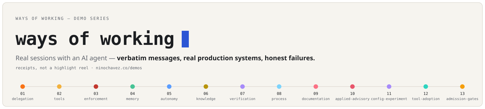

# ways of working — demo series



Public teaching demos of real AI-agent working sessions, published at
[ninochavez.co/demos](https://ninochavez.co/demos). Each demo is one real
session: verbatim messages, real production systems, honest failures.

This repository is the authoring and publishing source. The public experience
is rendered natively inside ninochavez.co, where each demo keeps its complete
story, diagrams, excerpts, images, and visual identity. `nc-demos.pages.dev`
serves the structured story feeds and source assets. At production cutover,
`demos.ninochavez.co` becomes a redirect to the matching native route.

## The demos

Ordered 01 → 13; each title links to the live session.

- **[01 · Twelve Messages](https://ninochavez.co/demos/twelve-messages)** — Everything typed to take a live event from spreadsheet chaos to published social content — and the method that made the other 99% happen.
- **[02 · The Browser Is a Shell Command](https://ninochavez.co/demos/browse-tool)** — Replacing 18,000 tokens of always-loaded browser-automation schema with ten shell commands and a README — and why the agent gets sharper, not weaker.
- **[03 · Taught Once, Enforced Forever](https://ninochavez.co/demos/enforced-forever)** — Corrections given in chat decay when the session ends. The fix is changing the agent's environment — helpers, deny-hooks, and CI ratchets that carry the rule forever.
- **[04 · Your Sessions Are a Corpus](https://ninochavez.co/demos/session-corpus)** — A 24 GB session archive forced the next question: how do you keep the lessons, prove closeout, and let the raw record expire?
- **[05 · The Product That Files Its Own Tickets](https://ninochavez.co/demos/feedback-loop)** — End users file feedback, an LLM judge triages it into GitHub Issues, an agent implements the safe ones — with the autonomy boundary in deterministic code and a human holding the only merge key.
- **[06 · The Registry of Landmines](https://ninochavez.co/demos/landmine-registry)** — Some load-bearing facts are invisible to search — the code compiles and the behavior is still wrong. One registry file holds them, a derive catalog enforces them in CI, and a meta-test keeps the registry from lying about itself.
- **[07 · The Agent Said It Checked](https://ninochavez.co/demos/said-it-checked)** — "Verified" is a sentence, not a fact. A security migration passed its audit while production was broken — and the discipline that came out of it caught three more false claims building this very series.
- **[08 · Gates Between Agentic Stages](https://ninochavez.co/demos/agentic-gates)** — Agents are strong inside a stage and unreliable at the boundaries. A delivery methodology built on that: deterministic gates between agentic stages — 88 versioned revisions, 14 running initiatives, and the day production published fiction.
- **[09 · The Beautifier Was an Auditor](https://ninochavez.co/demos/beautifier)** — A skill built to make a README prettier turned out to be a drift detector. Across five repos it flagged a stale deploy doc, a command list that no longer matched reality, and capabilities nobody had written down. The visual polish was the smallest thing it did.
- **[10 · The Chiropractor's Four Questions](https://ninochavez.co/demos/four-questions)** — A sports chiropractor asked four plain questions about selling rehab programs online. The AI's answer was confident, tabulated, sourced — and its evidence was marketing all the way down. Twice. The series' first client-facing session, with the audit that fixed it.
- **[11 · The Sycophancy Was in the Config](https://ninochavez.co/demos/config-probe)** — A rival model reviewing my agent's work looked sharper — it demanded competing candidates and restraint. So my agent A/B tested its own harness: same model, same prompt, config on and off. The vanilla arm pushed back on me twice. The configured arm never did.
- **[12 · One Component I Didn't Already Have](https://ninochavez.co/demos/adopt-or-skip)** — A plugin advertising eleven agents and fifty-four hooks, measured against the setup I already run. Three components were already going, one was the wrong platform, one broken upstream, two were costs. The delta was one — plus the retracted recommendation that got me there.
- **[13 · The Gate Was Written First](https://ninochavez.co/demos/gate-first)** — Three ways to make a meeting archive answer a question, three pass/fail gates committed to git before the model weights finished downloading, three refusals in one day. The feature that shipped is the one the evidence admitted.

## Applied

Technique companions to the numbered sessions — the reusable method, stripped
of one session's specifics, each linking back to the demo it was distilled
from. Live under `/applied/<slug>/`, listed on the homepage below the demo
gallery. Each carries a `number` in its `meta.json` — arrival order, like the
session arc — so the homepage and feed order is stable and a new technique
appends to the end instead of renumbering the list.

| Technique | Companion to |
|---|---|
| [Two Ways to Draw a System](https://ninochavez.co/demos/applied/two-ways) | — |
| [A Registry for What Grep Can't Find](https://ninochavez.co/demos/applied/registry) | [06](https://ninochavez.co/demos/landmine-registry) |
| [Promote a Correction to a Guardrail](https://ninochavez.co/demos/applied/guardrails) | [03](https://ninochavez.co/demos/enforced-forever) |
| [Gate Every Hand-Off](https://ninochavez.co/demos/applied/gates) | [08](https://ninochavez.co/demos/agentic-gates) |
| [Mine Your Own Transcripts](https://ninochavez.co/demos/applied/corpus) | [04](https://ninochavez.co/demos/session-corpus) |
| [Close the Session, Keep the Lesson](https://ninochavez.co/demos/applied/session-closeout) | [04](https://ninochavez.co/demos/session-corpus) |
| [Put Provenance Labels on AI Research](https://ninochavez.co/demos/applied/provenance) | [10](https://ninochavez.co/demos/four-questions) |
| [Bare-Arm Test Your Agent Config](https://ninochavez.co/demos/applied/config-probe) | [11](https://ninochavez.co/demos/config-probe) |
| [Run the Subtraction Before You Install](https://ninochavez.co/demos/applied/adopt-or-skip) | [12](https://ninochavez.co/demos/adopt-or-skip) |
| [One Heavy Job at a Time](https://ninochavez.co/demos/applied/one-heavy-job) | — |
| [The Home AI Server Question](https://ninochavez.co/demos/applied/local-vs-frontier) | Yawn note-taking study + context-plane build |

## Layout

```
demos/<slug>/
  deck.html   page content only (no <html>/<head>/<body> — build wraps it)
  meta.json   index-card fields: number, title, hook, date, for/get/do, preview
  img/        the demo's images, referenced as img/<name>
applied/<slug>/
  deck.html   same shape as demos/, no number — a technique, not a session
  meta.json   title, description, cardDesc, accent
  img/        optional
site/index.html   the index page; build injects cards at <!--DEMOS--> and <!--APPLIED-->
build.mjs         node build.mjs → dist/
```

`node build.mjs` also publishes the content consumed by ninochavez.co:

- `/content-index.json` inventories every session and applied technique.
- `/content/sessions/<slug>.json` carries each complete session story.
- `/content/techniques/<slug>.json` carries each complete applied story.

Each story includes the source revision and hash, its full ordered section
content, its visual rules, and a stable asset base. The consolidated site
scopes those visual rules to the demo story and renders the sections natively.
There is no iframe or screenshot-only substitute.

## Build

```sh
node build.mjs                        # full site → dist/
node build.mjs --artifact <slug>      # single self-contained HTML for private previews
```

No dependencies — plain Node (see `.nvmrc`).

## Adding a demo

1. Copy an existing demo folder as the starting point; diverge freely
   (no shared kit until a fourth demo exists and a shared bug has been fixed twice).
2. Sanitization is a required step, not a nicety: personal names and private
   links redacted, no secrets in screenshots, only already-public imagery.
3. Keep the failure segment. The series only stays credible while the demos
   are real sessions, not produced content.
